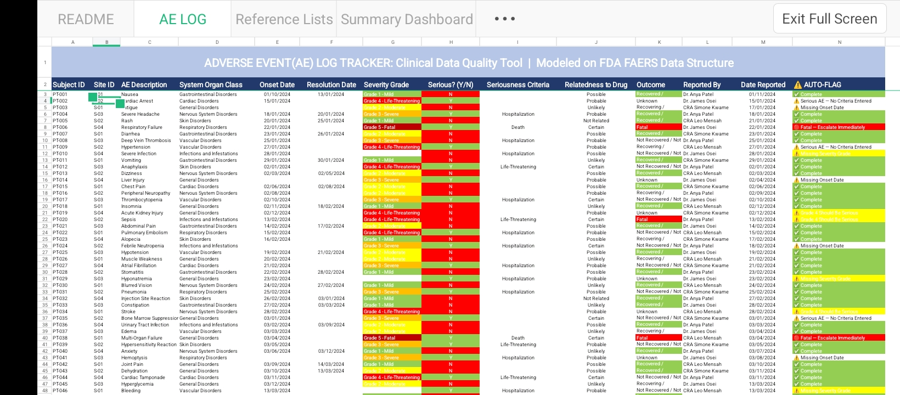
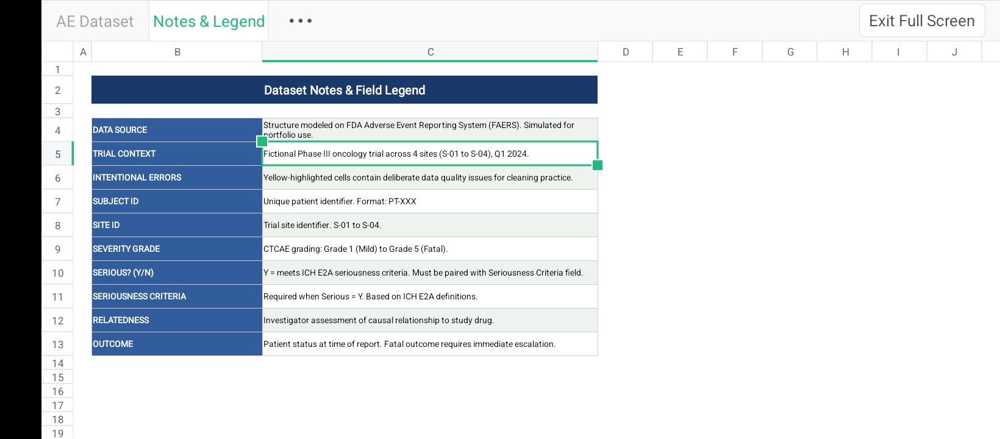
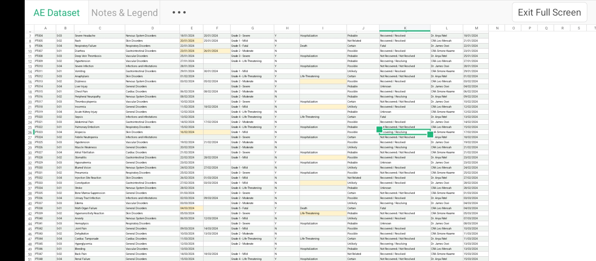
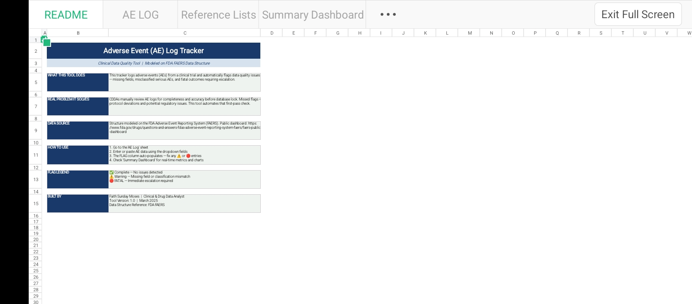
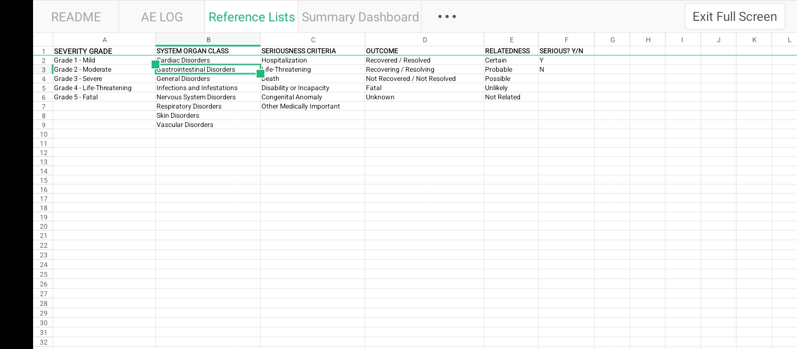
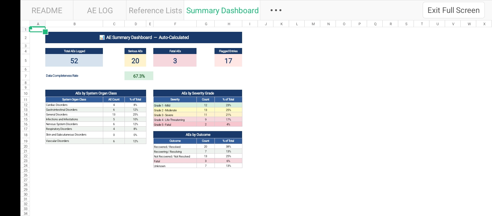

## Adverse Event (AE) Log Tracker & Data Quality Monitoring Tool

An Excel-based clinical data quality tool designed to simulate a first-pass review of adverse event (AE) data in a fictional Phase III oncology trial.
The tracker combines controlled data entry, rule-based validation, automated flagging, and summary reporting to identify incomplete records, potential classification inconsistencies, and events requiring review or escalation.

The dataset structure was informed by concepts and fields used in the FDA Adverse Event Reporting System (FAERS), while the workflow was adapted for a simulated clinical-trial AE log.

«Portfolio project: All study, patient, site, and AE data are simulated. No real patient data is used.»
"AE Log with auto-flags" 

## Project at a Glance
Role: Clinical Data Analyst — Independent Portfolio Project
Tool: Microsoft Excel
Study context| Fictional Phase III oncology trial
Sites| 4
AE records: 52 simulated records
Core workflow: AE data entry → validation → automated flagging → review → summary
Core feature: Formula-driven "AUTO-FLAG" column
Output: Four-sheet Excel workbook with controlled entry fields and live summary reporting

## Concepts Applied
- ICH E6(R2) Good Clinical Practice
- ICH E2A seriousness criteria
- CTCAE severity grading
- FAERS-informed data structure
- Clinical data quality review
- Rule-based validation
- Query identification and escalation

## THE PROBLEM 
Clinical data requires systematic review before it can be considered ready for downstream analysis or database lock.

An AE record may be present in the database but still contain problems such as:

- Missing onset dates
- Missing severity information
- Missing seriousness criteria
- Inconsistent seriousness classification
- Outcomes requiring escalation

Reviewing these issues manually across a large dataset can make it difficult to identify problems consistently.

This project demonstrates how simple spreadsheet automation can support a structured first-pass data quality review.

## What I Built

I designed an Excel-based AE tracker that allows a reviewer to:

1. Enter AE records using controlled fields
2. Standardise coded values through dropdown lists
3. Apply predefined data-quality rules to each record
4. Automatically identify records requiring review
5. Visually prioritise warnings and critical records
6. Monitor overall dataset quality through a summary dashboard

The goal was not to recreate a production EDC or safety database, but to demonstrate how clinical data requirements can be translated into a practical, rule-based workflow.

## Trial Context
The project uses a fictional Phase III oncology study to provide a realistic context for the dataset.

- Study type: Fictional Phase III oncology trial
- Sites: S-01 to S-04
- Reporting period: Q1 2024
- AE records: 52
- Patient identifiers: Simulated PT-XXX IDs
- Severity: CTCAE Grades 1–5
- Seriousness: ICH E2A criteria
- Data structure: Informed by FAERS concepts

## Data Quality Workflow
The workflow follows a simplified clinical data review process:

AE Data Entry
      ↓
Controlled Field Selection
      ↓
Automated Validation Checks
      ↓
AUTO-FLAG
      ↓
Review / Query / Escalation
      ↓
Dashboard & Quality Summary

This separates data capture from data-quality review, making it easier to identify records that require follow-up.

## Methodology

# 1. Data Structure Design

I defined the fields required to capture and review each simulated AE record, using FAERS-informed concepts while adapting the structure to a clinical-trial workflow.

# 2. Controlled Reference Values

I created a dedicated reference sheet containing standardised values for:
- Severity grade
- System Organ Class
- Seriousness criteria
- Outcome
- Relatedness
- Seriousness status

These values feed the workbook's dropdown menus and reduce free-text variation.

# 3. Simulated Data Creation

I created a dataset of 52 AE records and deliberately introduced data-quality issues into selected records.
Examples include:
- Missing onset dates
- Missing severity grades
- Serious events without recorded seriousness criteria
- Potential inconsistencies between severity and seriousness
- Fatal outcomes requiring escalation

The deliberate errors provided known test cases for validating the automated checks.

"Raw AE dataset" (docs/screenshots/05-raw-dataset.jpg)

"Dataset notes and field legend" (docs/screenshots/06-notes-and-legend.jpg)

# 4. Validation Logic

I created formula-based rules that evaluate each AE record and return an "AUTO-FLAG" status.
The logic checks for defined completeness and consistency conditions rather than attempting to determine clinical correctness.

# 5. Visual Prioritisation

Conditional formatting is used to distinguish:
- Records that pass the defined checks
- Records requiring review
- Records requiring critical escalation

# 6. Dashboard Development
A summary dashboard was added to provide an overview of the dataset, including AE volume, seriousness, outcomes, severity distribution, and flagged records.

# 7. Testing
The tracker was tested against the deliberately introduced data-quality issues to confirm that the corresponding validation rules identified the intended records.

## Workbook Structure
The workbook contains four main sheets:

# README
Provides an in-workbook explanation of the tool, workflow, instructions, and flag definitions.

# AE LOG

The primary data-entry and review sheet.
Each row represents an AE record and includes the formula-driven "AUTO-FLAG" field.

# Reference Lists
Contains the controlled values used by the workbook's dropdown fields.

# Summary Dashboard
Provides automatically calculated metrics and breakdowns for the current dataset.

## Data Fields

Field| Purpose
Subject ID| Simulated patient identifier in PT-XXX format
Site ID| Trial site identifier
AE Description| Description of the reported adverse event
System Organ Class| Body-system classification
Onset Date| Date the AE began
Resolution Date| Date the AE resolved
Severity Grade| CTCAE Grade 1–5
Serious? (Y/N)| Indicates whether the event is classified as serious
Seriousness Criteria| Criterion supporting the seriousness classification
Relatedness to Drug| Investigator's causality assessment
Outcome| Status/outcome of the event
Reported By| Investigator or CRA reporting the event
Date Reported| Date the AE was reported
AUTO-FLAG| Formula-driven data-quality status

## Reference Lists

Dropdowns are driven by a dedicated reference sheet so coded fields remain standardised and free-text variation is reduced.

- Severity Grade: Grade 1 — Mild, Grade 2 — Moderate, Grade 3 — Severe, Grade 4 — Life-Threatening, Grade 5 — Fatal
- System Organ Class: Cardiac, Gastrointestinal, General, Infections and Infestations, Nervous System, Respiratory, Skin, Vascular
- Seriousness Criteria: Hospitalization, Life-Threatening, Death, Disability or Incapacity, Congenital Anomaly, Other Medically Important
- Outcome: Recovered / Resolved, Recovering / Resolving, Not Recovered / Not Resolved, Fatal, Unknown
- Relatedness: Certain, Probable, Possible, Unlikely, Not Related
- Serious?: Y, N

## Validation Rules

The "AUTO-FLAG" column applies predefined checks to each record.

Validation Rule| Condition Detected| Action
Missing Onset Date| Onset Date is blank| Review/query the record
Missing Severity Grade| Severity Grade is blank| Review/query the record
Missing Seriousness Criteria| Serious = Y but no criterion is recorded| Review/query the record
Potential Grade 4 Inconsistency| Grade 4 + Serious = N| Review classification
Fatal Outcome| Outcome = Fatal| Escalate/review immediately
Complete| No defined rule is triggered| No data-quality flag

These rules are intentionally limited to the checks implemented in the workbook. They do not replace clinical review or investigator assessment.

## AUTO-FLAG Output

The tracker returns one of six statuses:

- Complete — No defined data-quality issue detected
- Warning — Missing Onset Date
- Warning — Missing Severity Grade
- Warning — Serious AE, No Criteria Entered
- Warning — Grade 4 Should be Serious
- Critical — Fatal, Escalate Immediately

Conditional formatting is used to make these statuses visible during review.

# Formula
The "AUTO-FLAG" formula is implemented directly in the AE LOG sheet and evaluates each record against the defined validation rules.

## Summary Dashboard

The dashboard provides a high-level view of the current dataset and updates automatically as records are added or corrected.

"Summary dashboard" (docs/screenshots/03-summary-dashboard.jpg)

Current Dataset
- Total AEs logged: 52
- Serious AEs: 20
- Fatal AEs: 3
- Flagged entries: 17
- Records passing the defined first-pass checks: 35
- Pass rate: 67.3%

# Breakdown Tables
The dashboard also provides:

- AEs by System Organ Class
- AEs by Severity Grade
- AEs by Outcome
- Counts and percentages for each category

## Key Findings
The simulated dataset produced several data-quality observations:

- 17 of 52 records were flagged, meaning approximately one-third of the dataset triggered at least one defined validation rule.
- 35 of 52 records passed the defined first-pass checks, giving a pass rate of 67.3%.
- 20 of 52 events were classified as serious.
- 3 records had a fatal outcome, triggering the critical escalation rule.
- Severity was distributed across all five CTCAE grades:
  - Grade 1: 12
  - Grade 2: 13
  - Grade 3: 11
  - Grade 4: 9
  - Grade 5: 2
- General Disorders was the largest System Organ Class, with 13 records.
- 20 events were recorded as recovered/resolved, while 13 were not recovered/not resolved at the time of reporting.

«These findings describe the simulated dataset and should not be interpreted as real clinical or pharmacovigilance findings.»

## Real-World Relevance

The workflow demonstrates concepts relevant to clinical data management and clinical research operations, including:

- First-pass AE data review
- Data completeness checks
- Identification of potential data inconsistencies
- Query identification
- Standardised data entry
- Risk-based review
- Escalation of critical records
- Data-quality monitoring
- Spreadsheet-based workflow automation

The project demonstrates the translation of clinical data requirements into a repeatable operational workflow.

## Skills Demonstrated
Clinical & Research
- Adverse event data review
- Severity and seriousness assessment
- Clinical data quality review
- Query identification
- Risk-based data monitoring
- GCP principles
- ICH E2A concepts
- CTCAE severity grading

Data & Technical
- Microsoft Excel
- Data validation
- Formula-based validation logic
- Conditional formatting
- Structured reference tables
- Dashboard development
- Data-quality monitoring
- Spreadsheet automation
- Technical documentation

## Limitations
This is a portfolio simulation and not a validated clinical system.

- All data is simulated.
- The field set is simplified compared with a production EDC or safety database.
- Events are classified at System Organ Class level; no term-level MedDRA coding is implemented.
- Excel does not provide the validated audit trail and controlled environment expected of regulated clinical systems.
- The validation rules identify predefined completeness and consistency issues but do not determine clinical correctness.
- The tool does not replace investigator review, medical review, pharmacovigilance assessment, or formal safety reporting processes.
- No real patient or clinical-trial data was used.

## Future Improvements
Potential extensions to the workflow include:
- Add date validation to identify resolution dates earlier than onset dates
- Add cross-checks between outcome and severity
- Add more comprehensive seriousness-consistency rules
- Add MedDRA-style term coding
- Add SAE reporting timeline monitoring
- Generate a query record automatically when a validation rule is triggered
- Add query status, owner, date raised, and resolution tracking
- Add Power BI reporting for trend analysis across sites and time
- Explore low-code/API automation for transferring flagged records into a query-management workflow

## How to Use
1. Download "AE_Log_Tracker.xlsx" from the repository.
2. Open the workbook in Microsoft Excel.
3. Navigate to the AE LOG sheet.
4. Enter or paste AE records using the controlled dropdown fields.
5. Review the "AUTO-FLAG" column.
6. Investigate records with warnings or critical flags.
7. Open the Summary Dashboard to review the updated dataset metrics.

No macros are required.

## Standards & References
This project applies concepts from:

- ICH E6(R2) — Good Clinical Practice
- ICH E2A — Clinical Safety Data Management: Definitions and Standards for Expedited Reporting
- CTCAE — Common Terminology Criteria for Adverse Events
- FDA FAERS — Used as an informing reference for aspects of the data structure

The project is an educational simulation and does not represent an FDA-approved, GCP-validated, or regulatory reporting system.

## Project Structure

ae-log-tracker/
│
├── README.md
├── AE_Log_Tracker.xlsx
│
└── docs/
    └── screenshots/
        ├── 01-readme-sheet.jpg
        ├── 02-ae-log-autoflags.jpg
        ├── 03-summary-dashboard.jpg
        ├── 04-reference-lists.jpg
        ├── 05-raw-dataset.jpg
        └── 06-notes-and-legend.jpg

## Project Outcome

This project demonstrates how an Excel-based workflow can be used to structure AE data, apply predefined data-quality checks, identify records requiring review, and present dataset-level quality metrics.

It also provides a foundation for extending the workflow into more advanced clinical data operations, query management, reporting, and automation.

## Access the Full Workbook

The complete Excel workbook, including the AE Log, Reference Lists, Summary Dashboard, and supporting files, is available here:

[View the full workbook on Google Drive](https://drive.google.com/drive/folders/1FIMjJi6vmpuvuhQmTM-709LE3UC6wBZ1)
